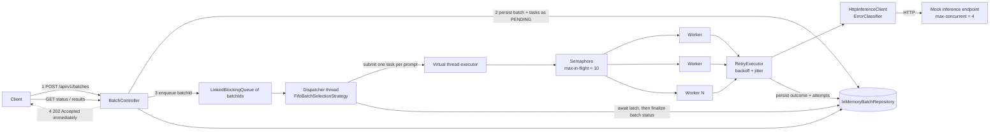
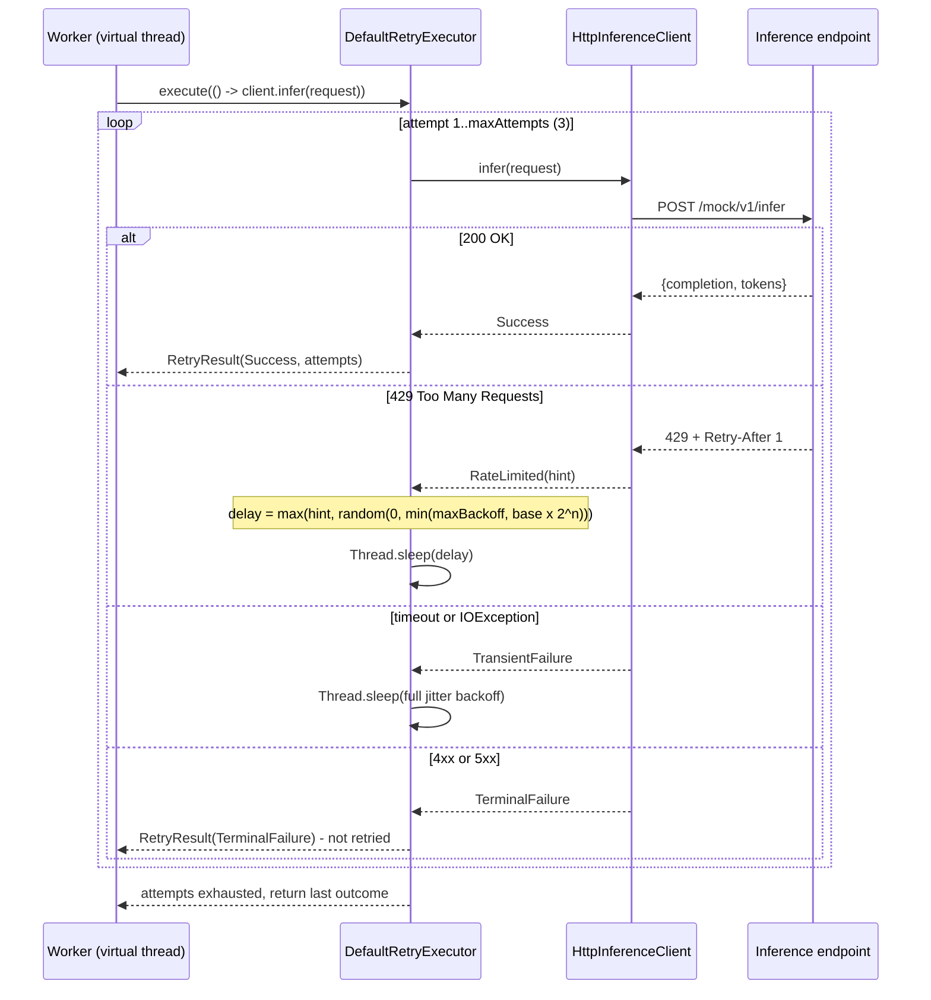
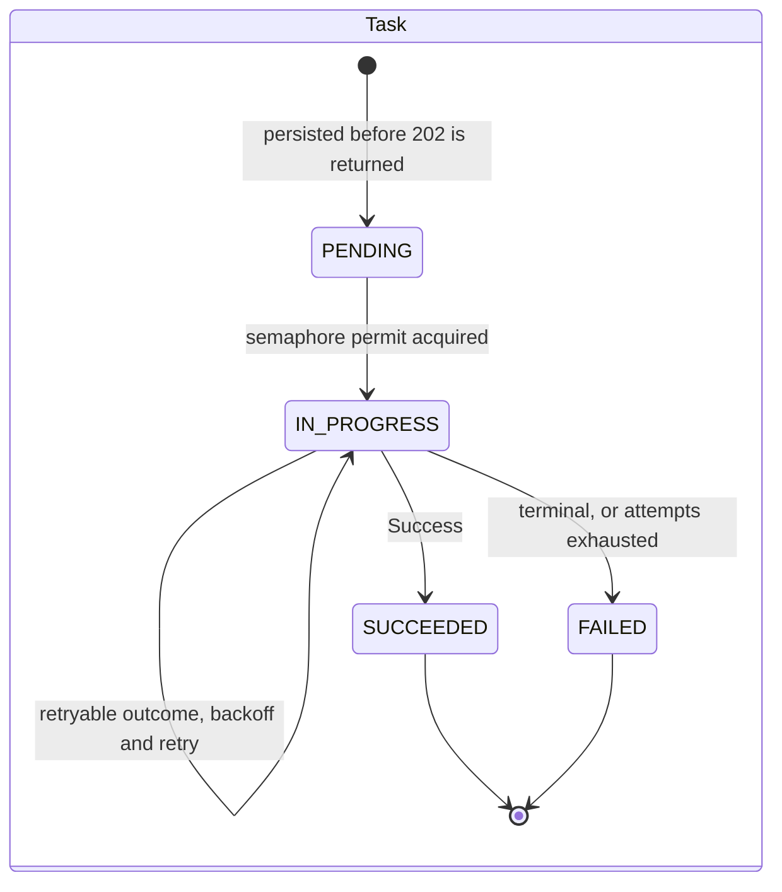

# DO-BatchInferenceEngine

## 1. Overview

DO-BatchInferenceEngine accepts a batch of AI prompts over HTTP, records the batch
durably before acknowledging it, and returns `202 Accepted` immediately rather than
holding the client open for the duration of the work. The prompts are then processed
concurrently against a rate-limited inference endpoint on virtual threads, with a global
cap on in-flight requests, exponential backoff with full jitter on retryable failures,
and per-task attempt accounting. Callers poll for batch status and collect aggregated
results, ordered by input index, when the batch settles.

The service ships with a mock inference endpoint that enforces its own concurrency limit
and returns `429 Too Many Requests` under load, so the throttling and backoff behaviour
can be observed end-to-end without an external dependency.

## 2. Quick Start

### Prerequisites

- **JDK 21.** The code uses virtual threads and pattern matching for `switch`, so 21 is a
  hard floor, not a preference.
- **Maven is not required.** The repository contains the Maven wrapper (`mvnw`,
  `mvnw.cmd`, and `.mvn/wrapper/`), which downloads and runs a pinned Maven version.
  Use `./mvnw` everywhere you would otherwise type `mvn`.
- No database, message broker, or other external service. State is held in memory.

### Clone and run

```bash
git clone <repository-url> DO-BatchInferenceEngine
cd DO-BatchInferenceEngine
./mvnw spring-boot:run
```

The service listens on `http://localhost:8080`.

**There is nothing else to start.** The mock inference endpoint is a controller inside
this same application, mounted at `/mock/v1/infer`, and `inference.base-url` points at it
by default. The application calls it over real HTTP through a `RestClient` rather than by
an in-process method call, so timeouts, status codes, headers, and JSON serialization are
genuinely exercised.

### Submit a batch

```bash
curl -s -X POST http://localhost:8080/api/v1/batches \
  -H 'Content-Type: application/json' \
  -d '{
        "prompts": [
          "Summarise the CAP theorem in one sentence.",
          "What is exponential backoff with jitter?",
          "Explain virtual threads to a backend engineer."
        ]
      }'
```

`202 Accepted`:

```json
{
  "batchId": "8f2b1c44-9a31-4d0e-9c2f-1b6e0a7d55e1",
  "promptCount": 3,
  "statusUrl": "/api/v1/batches/8f2b1c44-9a31-4d0e-9c2f-1b6e0a7d55e1"
}
```

The response returns as soon as the batch and all of its tasks are persisted as
`PENDING`. Processing happens afterwards.

### Poll batch status

```bash
curl -s http://localhost:8080/api/v1/batches/8f2b1c44-9a31-4d0e-9c2f-1b6e0a7d55e1
```

`200 OK`, mid-flight:

```json
{
  "batchId": "8f2b1c44-9a31-4d0e-9c2f-1b6e0a7d55e1",
  "status": "IN_PROGRESS",
  "submittedAt": "2026-09-16T10:14:02.118Z",
  "completedAt": null,
  "counts": {
    "PENDING": 0,
    "IN_PROGRESS": 2,
    "SUCCEEDED": 1,
    "FAILED": 0
  },
  "progressPercent": 33,
  "totalAttempts": 4
}
```

`progressPercent` counts settled tasks (`SUCCEEDED` plus `FAILED`) against the total.
`totalAttempts` exceeds the task count whenever retries have occurred, which is the
cheapest signal that the endpoint is pushing back.

### Fetch results

```bash
curl -s http://localhost:8080/api/v1/batches/8f2b1c44-9a31-4d0e-9c2f-1b6e0a7d55e1/results
```

`200 OK`:

```json
{
  "summary": {
    "total": 3,
    "succeeded": 2,
    "failed": 1,
    "totalAttempts": 5,
    "durationMs": 1432
  },
  "results": [
    {
      "inputIndex": 0,
      "prompt": "Summarise the CAP theorem in one sentence.",
      "status": "SUCCEEDED",
      "completion": "A distributed store can guarantee at most two of consistency, availability, and partition tolerance.",
      "failureReason": null,
      "attempts": 1
    },
    {
      "inputIndex": 1,
      "prompt": "What is exponential backoff with jitter?",
      "status": "SUCCEEDED",
      "completion": "Retrying after a randomised, exponentially growing delay so that clients do not retry in lockstep.",
      "failureReason": null,
      "attempts": 2
    },
    {
      "inputIndex": 2,
      "prompt": "Explain virtual threads to a backend engineer.",
      "status": "FAILED",
      "completion": null,
      "failureReason": "rate limited by inference endpoint (retry after 1000ms)",
      "attempts": 3
    }
  ]
}
```

Results are always ordered by `inputIndex`, never by completion order. The results
endpoint is readable at any time; before the batch settles it reports whatever has
completed so far, with `durationMs` measured to the current instant.

To watch throttling and backoff take effect, submit a batch of 50 or so prompts and read
`totalAttempts` as it climbs: `concurrency.max-in-flight` is 10 while the mock only
admits 4 concurrent calls, so the excess is rejected with `429` and retried.

## 3. Configuration

All keys live in `src/main/resources/application.yaml` and bind to validated
`@ConfigurationProperties` records. Any of them can be overridden with a Spring
environment variable or `--key=value` argument at startup.

### `inference.*` — the outbound client

| Key | Default | Controls |
| --- | --- | --- |
| `inference.base-url` | `http://localhost:8080/mock/v1` | Base URL of the inference endpoint. Pointing this at a real provider is the only change needed to leave the mock behind. |
| `inference.api-key` | `""` (empty) | Sent as a bearer credential when non-empty; the mock ignores it. |
| `inference.connect-timeout` | `2s` | TCP connect timeout. Short, because a connect that is slow is a connect that is failing. |
| `inference.read-timeout` | `10s` | Response read timeout. Exceeding it is classified as a transient failure and is retried. |

### `concurrency.*` — scheduling limits

| Key | Default | Controls |
| --- | --- | --- |
| `concurrency.max-in-flight` | `10` | Global cap on simultaneous inference calls across all batches, enforced by a `Semaphore`. This, not a thread pool size, is what protects the downstream endpoint. |
| `concurrency.batch-queue-capacity` | `100` | Depth of the pending-batch queue. Submissions beyond it are rejected with `503` rather than queued without bound. |
| `concurrency.max-batch-size` | `1000` | Maximum prompts in a single submission. Larger requests are rejected with `400`. |

### `retry.*` — backoff policy

| Key | Default | Controls |
| --- | --- | --- |
| `retry.max-attempts` | `3` | **Total** attempts per task: the initial call plus two retries. Not three retries. |
| `retry.initial-backoff` | `200ms` | Base delay for the exponential schedule; the delay for attempt *n* is drawn uniformly from `[0, min(max-backoff, initial-backoff × 2ⁿ))`. |
| `retry.max-backoff` | `5s` | Ceiling on the computed backoff window, before any `Retry-After` floor is applied. |

### `mock.inference.*` — the simulated endpoint

| Key | Default | Controls |
| --- | --- | --- |
| `mock.inference.enabled` | `true` | Registers the mock controller. Set to `false` when pointing `inference.base-url` at a real endpoint; the bean is behind `@ConditionalOnProperty`. |
| `mock.inference.base-latency` | `150ms` | Floor on simulated processing time per call. |
| `mock.inference.latency-jitter` | `100ms` | Uniform random latency added to the floor, so completion order is nondeterministic as it would be in reality. |
| `mock.inference.max-concurrent` | `4` | Concurrent calls the mock will admit before responding `429`. |
| `mock.inference.retry-after` | `1s` | Value of the `Retry-After` header on a `429`. |

`mock.inference.max-concurrent` (4) is deliberately set **below**
`concurrency.max-in-flight` (10). The service will therefore always push harder than the
endpoint accepts, which is the point: it guarantees `429` responses occur in a default
run, so retry, backoff, and jitter are exercised rather than merely implemented. Raising
the mock limit to 10 or above makes the demo quieter and proves nothing.

One further key is worth knowing about: `spring.threads.virtual.enabled` is `true`, so
Tomcat handles inbound requests on virtual threads as well.

## 4. API Reference

All endpoints are under `/api/v1/batches`. Request and response bodies are JSON.

Errors share one shape, with `details` present only for field-level validation failures:

```json
{
  "error": "validation_failed",
  "message": "Request body is invalid",
  "details": ["prompts: must not be empty"]
}
```

### `POST /api/v1/batches`

Submits a batch. Returns as soon as the batch is persisted.

Request:

```json
{ "prompts": ["first prompt", "second prompt"] }
```

`prompts` must be present, non-empty, contain no blank entries, and hold no more than
`concurrency.max-batch-size` items.

Response `202 Accepted`:

| Field | Type | Meaning |
| --- | --- | --- |
| `batchId` | string (UUID) | Identifier for subsequent status and result calls. |
| `promptCount` | int | Number of tasks created. |
| `statusUrl` | string | Convenience path to the status endpoint. |

| Status | Condition |
| --- | --- |
| `202 Accepted` | Batch and tasks persisted as `PENDING` and handed to the dispatcher. |
| `400 Bad Request` | `prompts` missing, empty, containing a blank entry, exceeding `max-batch-size`, or a body that cannot be parsed. |
| `503 Service Unavailable` | Dispatcher queue is full (`batch-queue-capacity` reached) or the dispatcher is shutting down. Error code `queue_full`; the submission is safe to retry. |

### `GET /api/v1/batches/{id}`

Current status of a batch.

| Field | Type | Meaning |
| --- | --- | --- |
| `batchId` | string | Echo of the identifier. |
| `status` | enum | `PENDING`, `IN_PROGRESS`, `COMPLETED`, or `COMPLETED_WITH_ERRORS`. |
| `submittedAt` | ISO-8601 instant | When the batch was accepted. |
| `completedAt` | ISO-8601 instant, nullable | Null until every task has settled. |
| `counts` | object | Task count keyed by `PENDING`, `IN_PROGRESS`, `SUCCEEDED`, `FAILED`. All four keys are always present. |
| `progressPercent` | int | Settled tasks as a percentage of the total. |
| `totalAttempts` | int | Sum of attempts across all tasks; greater than the task count implies retries. |

A batch reaches `COMPLETED_WITH_ERRORS` rather than `COMPLETED` if any single task
finished `FAILED`. Both are terminal: partial failure does not fail the whole batch.

| Status | Condition |
| --- | --- |
| `200 OK` | Batch found. |
| `404 Not Found` | Unknown `batchId`. Error code `batch_not_found`. |

### `GET /api/v1/batches/{id}/results`

Per-prompt results plus an aggregate summary.

`summary`:

| Field | Type | Meaning |
| --- | --- | --- |
| `total` | int | Task count. |
| `succeeded` | int | Tasks in `SUCCEEDED`. |
| `failed` | int | Tasks in `FAILED`. |
| `totalAttempts` | int | Sum of attempts across all tasks. |
| `durationMs` | long | Submission to completion; to *now* if the batch has not settled. |

`results[]`, sorted ascending by `inputIndex`:

| Field | Type | Meaning |
| --- | --- | --- |
| `inputIndex` | int | Position in the submitted `prompts` array. |
| `prompt` | string | The original prompt, echoed so results are self-contained. |
| `status` | enum | `PENDING`, `IN_PROGRESS`, `SUCCEEDED`, or `FAILED`. |
| `completion` | string, nullable | Model output; null unless `SUCCEEDED`. |
| `failureReason` | string, nullable | Classification and cause; null unless `FAILED`. |
| `attempts` | int | Attempts consumed, at most `retry.max-attempts`. |

| Status | Condition |
| --- | --- |
| `200 OK` | Batch found. Readable before completion. |
| `404 Not Found` | Unknown `batchId`. |

## 5. Architecture

### Request and execution flow

The diagram below traces a submission from arrival to completion. The ordering of steps
1 through 4 is the important part: the batch and its tasks are written to the repository
*before* the `202` is emitted, and the dispatcher queue holds only batch identifiers, not
work. Past the queue, a single dispatcher thread selects one batch, submits one task per
prompt to the virtual-thread executor, and each worker must take a permit from the global
semaphore before it may issue an HTTP call. Retry and error classification sit between
the worker and the client, so backoff happens while holding a permit and therefore
naturally reduces pressure on the endpoint.



### Retry and classification of a single call

This diagram covers one task's journey through the retry executor. The loop runs at most
`retry.max-attempts` times in total. What distinguishes the branches is not severity but
expected recovery time: a `429` carries an explicit hint about when to come back, a
timeout or `IOException` carries no information but is plausibly self-correcting, and a
`4xx` or `5xx` is treated as terminal and consumes no further attempts. The delay
calculation, `max(hint, random(0, min(maxBackoff, base × 2ⁿ)))`, applies full jitter and
then respects any `Retry-After` as a lower bound.



### Task lifecycle

Every prompt is a task with an explicit state machine. `PENDING` is reached inside the
request thread, before the client is told anything, which is what makes the
acknowledgement honest. `IN_PROGRESS` begins only once a semaphore permit is held, so the
state also records that the task is genuinely consuming downstream budget rather than
merely queued. Retries are self-transitions on `IN_PROGRESS`: an attempt that will be
retried does not move the task out of the running state, and attempt count rather than
status carries that history. `SUCCEEDED` and `FAILED` are terminal, and no transition
ever returns a task to `PENDING`.



## 6. Design Decisions and Trade-offs

### Persist before acknowledge

`BatchController.submit` writes the batch and every one of its tasks as `PENDING`, and
only then returns `202`. The enqueue to the dispatcher happens after the write, not
before.

The alternative — acknowledge first, persist asynchronously — is faster by the cost of a
map write and is wrong. A `202` is a promise that the work is now the service's
responsibility. If the process dies between acknowledgement and durable state, the client
holds a batch identifier for work that no longer exists anywhere, and it has no way to
detect this: a status call returns `404`, which is indistinguishable from a typo in the
identifier. The client cannot safely retry either, because it cannot tell whether the
original submission was lost or merely slow.

Ordering the write first converts that failure into an honest one. If persistence fails,
the client gets a `5xx` and knows the submission did not take. This is the core
correctness decision in the service, and it is why the repository write is synchronous on
the request path even though everything else about the design is asynchronous.

Note that with the current in-memory repository, "durable" means "durable for the
lifetime of the process". The ordering is still what matters: it is the property that
survives swapping the repository for a database, and retrofitting it later would mean
changing the meaning of the API's most important response code.

### Virtual threads bounded by a semaphore, not a fixed pool

Workers run on `Executors.newVirtualThreadPerTaskExecutor()`, and concurrency is limited
by a single `Semaphore` sized from `concurrency.max-in-flight`.

The conventional approach is a fixed platform-thread pool whose size *is* the concurrency
limit. That conflates two unrelated numbers. The work here is pure I/O — an HTTP call and
a wait — so thread count is an implementation detail of how blocking is represented,
while the real constraint is how many simultaneous requests the downstream endpoint
tolerates. Tying them together means that changing the rate limit requires resizing a
thread pool, and that the limit is invisible in the code: it is a constructor argument to
an executor, not a named concept.

Separating them makes the limit explicit and independently tunable, and it makes backoff
free. A worker sleeping through a jittered delay is a parked virtual thread costing a few
hundred bytes of heap, not a blocked OS thread starving other work. With a fixed pool of
10, ten tasks in backoff would idle the entire service; here they idle nothing. The
semaphore permit is deliberately held across the retry loop, so a task waiting out a `429`
continues to count against the in-flight budget — which is the correct behaviour, since
the endpoint is the resource being protected and it is still recovering.

### Why both a semaphore and a per-batch latch

Two mechanisms are needed because two distinct behaviours are required, and neither
implies the other.

The `Semaphore` is global. It bounds concurrent in-flight calls across every batch and
protects the downstream endpoint. It says nothing about which batch those calls belong
to.

The `CountDownLatch` is per batch. `QueueBatchDispatcher` submits all tasks of a batch and
then, because `FifoBatchSelectionStrategy.completeBatchBeforeNext()` is true, blocks on
the latch before selecting the next batch. This produces head-of-line FIFO ordering
*between* batches: batch two does not start until batch one has fully settled.

A semaphore alone gives only the first property. With permits but no latch, tasks from
several batches interleave freely; all batches progress at once and all finish late.
Whether that is better depends on what clients want, and FIFO was chosen here because
"submitted first, finished first" is predictable and easy to reason about. The cost is
head-of-line blocking, which is acknowledged under Known Limitations and addressed by the
alternative selection strategy under Future Enhancements. The point is that the two
mechanisms are orthogonal: the latch is scheduling policy, the semaphore is resource
protection, and collapsing them into one would lose one of the two behaviours.

### Full jitter on exponential backoff

The delay before attempt *n* is drawn uniformly from
`[0, min(retry.max-backoff, retry.initial-backoff × 2ⁿ))`, rather than being set to the
bound itself.

Plain exponential backoff fails in exactly the situation it is meant to fix. Rate limits
are usually hit by many workers at once, so many workers receive a `429` at nearly the
same instant. If each sleeps for an identical computed duration, they all wake together
and retry together, reproducing the original burst one backoff period later — an overload
on a timer, with the retries now synchronised more tightly than the original traffic was.
Growing the delay only spaces out the collisions; it does not stop them.

Randomising across the whole interval spreads the retries into a continuous distribution,
so the recovering endpoint sees a ramp instead of a wall. Full jitter is chosen over
partial or decorrelated jitter for its lower expected delay and its single-line
implementation; the difference between jitter strategies is small compared to the
difference between jitter and none.

### `Retry-After` as a floor, not a replacement

When the endpoint supplies a `Retry-After` header, the delay used is
`max(hint, jitteredDelay)`.

The hint is authoritative about the earliest time a retry can succeed — the server knows
its own window — so retrying before it expires is guaranteed to waste an attempt. But it
is not authoritative about the latest sensible time, and obeying it exactly reintroduces
the synchronisation problem the jitter exists to prevent: every client that received the
same `Retry-After: 1` would return at the same moment. Taking the maximum honours the
server's floor while keeping the randomised spread whenever the computed backoff has
already grown past it.

### Error classification in one method

One method maps an HTTP outcome onto the sealed `InferenceOutcome` hierarchy —
`Success`, `RateLimited`, `TransientFailure`, `TerminalFailure` — and the retry executor
decides purely from that type. The classification is a value, not a control-flow side
effect, so it can be unit tested directly and there is exactly one place to change the
policy.

The policy: `429` is retried, and transport-level failures (connect and read timeouts,
`IOException`, connection reset) are retried. Everything else, including `5xx`, is
terminal.

Treating `5xx` as terminal is a deliberate and debatable choice. The reasoning is that a
server-side fault has an unknown recovery time. Unlike a `429`, which carries an implicit
or explicit statement about when to return, a `500` tells the client nothing about
whether the condition will clear in a millisecond or an hour. Spending the remaining
attempt budget guessing is likely to exhaust it against a still-broken endpoint and add
load to a server that is already unhealthy, and the task fails anyway — just later, and
with a worse effect on the downstream.

**`502`, `503`, and `504` are conventionally transient**, and a reasonable engineer would
retry them: they usually indicate a bad gateway, a temporarily unavailable backend, or an
upstream timeout, all of which do often clear quickly. The choice here favours failing
fast and surfacing the fault, and it is reversible by adding those three codes to the
retryable branch of the classifier. It is one line in one method precisely so that this
can be reconsidered without touching the retry executor, the worker, or the dispatcher.

### `maxAttempts` is total attempts, not retries

`retry.max-attempts = 3` means one initial call plus at most two retries, for three calls
in the worst case. It does not mean three retries after an initial call.

This is worth stating explicitly because the two readings differ by 33% in load against
the downstream, and libraries disagree on the convention. The `attempts` field on every
result reports the same number under the same definition, so a result showing
`"attempts": 3` has exhausted the budget.

### In-memory storage behind a `BatchRepository` interface

`InMemoryBatchRepository` stores batches and tasks in `ConcurrentHashMap`s. It is an
implementation of `BatchRepository`, and nothing outside the repository package refers to
the concrete class.

This is a delivery-speed decision under a time box, not an oversight: a database brings
schema management, migrations, a connection pool, transaction boundaries, test
containers, and configuration, none of which exercise the concurrency and retry behaviour
that is the actual subject of this service. Spending the time budget there would have
produced a less interesting scheduler.

What makes it a considered decision rather than a shortcut is that the seam is shaped for
the replacement. The interface is deliberately DB-shaped: `saveBatch` takes a batch and
its tasks together so it maps onto a single transaction; `updateTask` replaces a whole
record rather than exposing field-level mutators; lookups return `Optional` and detached
`List` snapshots. Every method returns defensive copies of immutable records, never live
references into the store, so no caller can hold something that later mutates underneath
it — which is precisely the discipline a JDBC implementation would enforce anyway, and
precisely where an in-memory store usually leaks. A JDBC or JPA implementation is one new
class and one bean definition, and no calling code changes.

The honest cost is stated under Known Limitations: state does not survive a restart.

### The mock endpoint is called over real HTTP

The mock lives in this application as a Spring controller at `/mock/v1/infer`, but the
service reaches it through `RestClient` over a real TCP connection to
`inference.base-url`, not by injecting the controller and calling a method.

An in-process call would be faster and simpler, and would test almost nothing. Routing
over HTTP means connection pooling, connect and read timeouts, status code handling,
header parsing (including `Retry-After`), and JSON serialization in both directions are
all genuinely exercised. The `429` path in particular only means something if a real
status code is produced by a real response and parsed by a real client; simulating it
with a thrown exception would test the test.

The mock is registered behind `@ConditionalOnProperty` on `mock.inference.enabled`, and
the client's target is `inference.base-url`. Pointing the service at a real provider is
therefore two configuration values and no code change — and because the transport has
been real all along, nothing about the client's behaviour changes when the endpoint
becomes external.

### The mock throttles on real concurrency, not on a counter

The mock returns `429` when the number of calls currently in flight inside it exceeds
`mock.inference.max-concurrent`, tracked with an atomic counter incremented on entry and
decremented on exit. It does not reject every Nth request.

An every-Nth-request rule is easier to write and actively misleading, because its `429`
rate is a function of request count alone. Client-side backoff cannot reduce it: whatever
the retry policy does, the same fraction of requests is rejected, so the graph looks
identical whether the backoff implementation is correct, broken, or absent.

Rejecting on actual concurrency makes the feedback loop real. When workers back off, the
number of simultaneous calls falls, and the `429` rate falls with it — so effective
backoff is visible in `totalAttempts`, and a regression in the jitter or delay
calculation shows up as a measurable increase. The mock has to model the constraint
rather than imitate its symptom for the demonstration to carry any information.

### Results are sorted by input index

`findTasks` returns tasks ordered by `inputIndex`, and the results endpoint preserves that
order.

Completion order under concurrency is nondeterministic by construction — the mock even
adds `latency-jitter` to guarantee it — so returning results in completion order would
make the response unstable across identical runs. Clients almost always need to line
results up against the prompts they submitted, and forcing every client to sort by
`inputIndex` is duplicated work and an easy thing to get wrong. Sorting once, server-side,
makes the response a deterministic function of the request.

### Immutable records throughout

`Batch`, `PromptTask`, the DTOs, and the `InferenceOutcome` variants are all records with
no setters. State changes go through `withStatus`, `withStarted`, `withSuccess`, and
`withFailure`, each returning a new instance, and `BatchRepository.updateTask` replaces
the stored value wholesale.

In a service where many virtual threads read and write task state concurrently, this
removes the largest category of bug by construction. There is no shared mutable object
for two workers to interleave on, no partially-updated record visible to a reader, and
no need to reason about whether a `GET /results` running concurrently with a worker might
observe a task that is half-updated. Publication is a single map write of a fully
constructed value, so the repository's `ConcurrentHashMap` is sufficient synchronisation
on its own and no additional locking is required.

The cost is allocation on every transition, which is irrelevant at this scale and is
exactly what generational garbage collection handles best. The sealed `InferenceOutcome`
hierarchy additionally lets the dispatcher exhaustively pattern match on the result, so
adding a new outcome type is a compile error at every site that must handle it rather
than a silent fall-through.

## 7. Known Limitations

- **State is lost on restart.** Batches and results live in memory. Stopping the
  application discards every submitted batch, including completed ones with results that
  were never collected.
- **There is no crash recovery.** In-flight work is not persisted anywhere, so tasks that
  were `IN_PROGRESS` when the process died are not resumed or retried on startup. There
  is no reconciliation pass.
- **No authentication or authorization.** Every endpoint is open, and any caller who
  knows or guesses a `batchId` can read its prompts and completions. `inference.api-key`
  secures the outbound call only; there is no inbound credential.
- **A large batch blocks later batches, by design.** FIFO selection waits for the current
  batch to settle completely, so a 1000-prompt submission delays a 2-prompt submission
  behind it for the full duration. This is a chosen scheduling policy, not a defect, but
  it is a real constraint on latency for small batches.
- **Single-node only.** The queue, the semaphore, and the store are all process-local.
  Running two instances behind a load balancer gives two independent services: a batch is
  visible only on the node that accepted it, and the in-flight limit is enforced per node,
  so the effective rate against the endpoint doubles.
- **No backpressure signal beyond the queue depth.** A submission is accepted or rejected
  with `503`; there is no way for a client to learn how long the queue is or when to
  return.

## 8. Future Enhancements

Each of these plugs into an existing seam; none requires restructuring the service.

- **Client-side token bucket with AIMD.** Wraps `InferenceClient` as a decorator, so
  neither the worker nor the retry executor changes. Today the service discovers the rate
  limit by failing into it: it pushes until the endpoint returns `429`, then backs off.
  A token bucket throttles proactively, and additive-increase/multiplicative-decrease
  tuning of the fill rate — halve on a `429`, increase gently on sustained success —
  converges toward the endpoint's actual limit instead of repeatedly rediscovering it.
  Retry then becomes the exception path it should be rather than the normal control loop.
- **Circuit breaker for a hard-down endpoint.** Belongs at the dispatcher level, around
  task submission, where it can stop work for the whole service rather than per call.
  When every request is failing, the current design still spends three attempts per task
  before giving up, multiplied across the batch. The critical detail: **tasks in flight
  when the breaker opens must be returned to `PENDING`, never `FAILED`.** Marking them
  failed would record a permanent result for prompts that were never really attempted,
  and since results are a batch's only output, the service would silently drop prompts.
  This is the one enhancement here that can introduce data loss if implemented carelessly.
- **JDBC or JPA `BatchRepository`.** One new class implementing the existing interface and
  one bean definition. The interface already returns detached snapshots, so no caller
  changes. This is the prerequisite for genuine durability and for everything below that
  depends on it.
- **Round-robin `BatchSelectionStrategy`.** The interface exists; this is a second
  implementation returning `false` from `completeBatchBeforeNext()` and interleaving
  batches from the pending queue. It removes head-of-line blocking so a large batch no
  longer starves small ones, at the cost of no batch finishing as early as it would under
  FIFO. Making it configurable lets the trade-off be chosen per deployment.
- **`Idempotency-Key` on ingestion.** A header checked against a key-to-`batchId` map in
  the repository before the batch is created: a repeat of a key already seen returns the
  original `batchId` and `202` rather than creating a second batch. Without it, a client
  that retries a submission after a timeout — precisely the behaviour the `202` contract
  encourages — double-processes every prompt and pays twice.
- **Lease and heartbeat reclaim.** Tasks would take a time-bounded lease on start and
  renew it while running; a sweeper returns tasks with expired leases to `PENDING`. This
  is what makes crash recovery real, and it is only meaningful once storage is durable —
  with the in-memory store, a crash destroys the tasks that would be reclaimed, so it must
  follow the JDBC repository rather than precede it.
- **Micrometer metrics.** Counters and timers at the points that already compute the
  numbers: throughput (tasks settled per second), a histogram of attempts per task, the
  `429` rate as a fraction of calls, and p99 end-to-end latency per task. These are the
  four signals needed to tell whether the backoff configuration is right, and they are
  currently only observable by reading `totalAttempts` and logs.

## 9. CI/CD

`.github/workflows/ci.yml` runs on every push and pull request targeting `main`. It is a
single job on `ubuntu-latest`:

1. `actions/checkout@v4`.
2. `actions/setup-java@v4` with Temurin 21 and `cache: maven`, so dependencies are
   restored between runs instead of re-downloaded.
3. `chmod +x mvnw`, because the executable bit does not survive every checkout path.
4. `./mvnw -B clean verify` — compile, unit tests, and integration tests in batch mode.
5. `actions/upload-artifact@v4` with `if: always()`, publishing
   `**/target/surefire-reports/**`.

The `if: always()` on the upload is the part that matters. Test reports are most needed
when the build is red, which is exactly when a default-conditioned step would be skipped.

One `.gitignore` detail is load-bearing for this pipeline. The standard Java ignore list
contains `*.jar`, which silently excludes `.mvn/wrapper/maven-wrapper.jar`; the wrapper
then fails to resolve on a clean CI checkout even though it works on every developer
machine that has the file locally. The negation `!.mvn/wrapper/maven-wrapper.jar` must
appear *after* the `*.jar` line, since later patterns win.

There is deliberately **no deploy job.** A commented stub in the workflow shows where a
GHCR image build and push would go — as a second job gated on `needs: build` and a push
to `main`, using `docker/login-action` with the built-in `GITHUB_TOKEN` and
`packages: write`. It is left unimplemented because there is no deployment target for
this service and no Dockerfile in the repository, and a publish step that nothing consumes
is a pipeline stage to maintain in exchange for nothing. The stub records the intended
shape so that adding it later is a decision about deployment, not about CI.

## 10. Project Structure

```
DO-BatchInferenceEngine
├── .github/workflows/ci.yml          Build, test, publish surefire reports
├── .mvn/wrapper/                     Pinned Maven; maven-wrapper.jar must stay tracked
├── mvnw, mvnw.cmd                    Wrapper entry points — no local Maven needed
├── pom.xml                           Spring Boot 3.3.x, Java 21, web + validation only
└── src
    ├── main
    │   ├── java/com/digitalocean/batchinference
    │   │   ├── BatchInferenceApplication.java    Entry point
    │   │   ├── api/                              HTTP boundary
    │   │   │   ├── BatchController.java            Submit, status, results; persists before 202
    │   │   │   ├── BatchNotFoundException.java     Mapped to 404
    │   │   │   ├── GlobalExceptionHandler.java     Validation and errors to the ErrorResponse shape
    │   │   │   └── dto/                            Request and response records
    │   │   ├── config/                           Typed configuration and shared beans
    │   │   │   ├── BeanConfig.java                 Virtual-thread executor, in-flight Semaphore
    │   │   │   ├── ConcurrencyProperties.java      concurrency.*
    │   │   │   ├── InferenceProperties.java        inference.*
    │   │   │   ├── MockProperties.java             mock.inference.*
    │   │   │   └── RetryProperties.java            retry.*
    │   │   ├── domain/                           Immutable core model
    │   │   │   ├── Batch.java                      Record; withStatus returns a new instance
    │   │   │   ├── BatchStatus.java                PENDING, IN_PROGRESS, COMPLETED, COMPLETED_WITH_ERRORS
    │   │   │   ├── PromptTask.java                 Record; withStarted / withSuccess / withFailure
    │   │   │   └── TaskStatus.java                 PENDING, IN_PROGRESS, SUCCEEDED, FAILED
    │   │   ├── inference/                        Outbound call and its result model
    │   │   │   ├── InferenceClient.java            Returns outcomes; never throws for expected failures
    │   │   │   ├── InferenceOutcome.java           Sealed: Success, RateLimited, Transient, Terminal
    │   │   │   ├── InferencePayloadMapper.java     Keeps vendor wire shapes out of the scheduler
    │   │   │   └── InferenceRequest/Response.java  Domain-side payloads
    │   │   ├── mock/                             Simulated endpoint, @ConditionalOnProperty
    │   │   │                                       429 on real in-flight concurrency, sends Retry-After
    │   │   ├── repository/                       Persistence seam
    │   │   │   ├── BatchRepository.java            DB-shaped interface; returns detached snapshots
    │   │   │   └── InMemoryBatchRepository.java    ConcurrentHashMap implementation
    │   │   ├── retry/                            Attempt policy
    │   │   │   ├── BackoffPolicy.java              Full jitter; Retry-After as a floor
    │   │   │   └── RetryExecutor.java              Wraps a call, reports outcome + attempts
    │   │   └── scheduling/                       Execution core
    │   │       ├── BatchDispatcher.java            Non-blocking enqueue; false when full
    │   │       ├── BatchSelectionStrategy.java     Which batch next, and whether to drain it first
    │   │       ├── FifoBatchSelectionStrategy.java Strict submission order
    │   │       └── QueueBatchDispatcher.java       Queue, dispatcher thread, semaphore, per-batch latch
    │   └── resources/application.yaml            All defaults documented in Configuration
    └── test/java/com/digitalocean/batchinference
        └── BatchFlowIntegrationTest.java         Submit to completion, 400 and 404 paths
```
